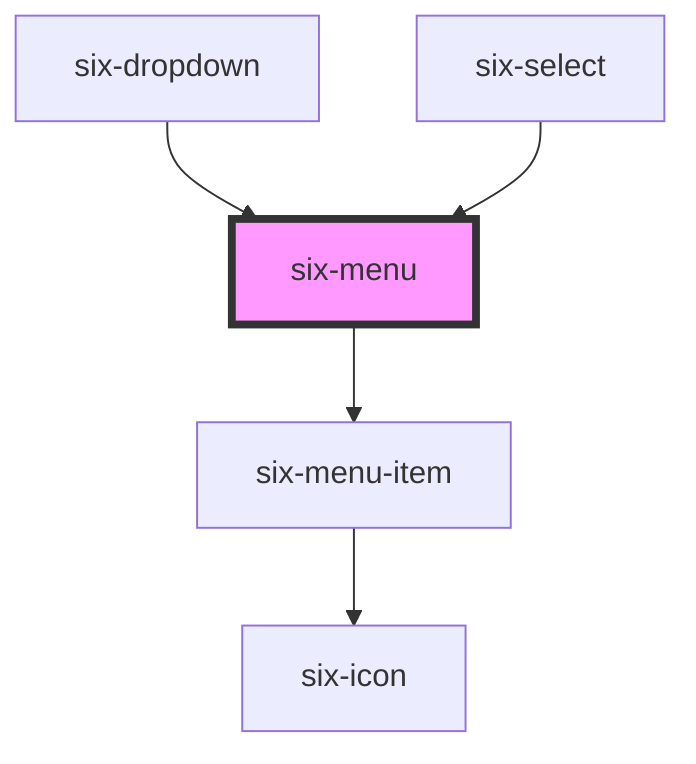

# six-menu

<!-- EXAMPLES -->

<!-- Auto Generated Below -->

## Properties

| Property            | Attribute            | Description                                                                                                                                                                                                                         | Type                | Default               |
| ------------------- | -------------------- | ----------------------------------------------------------------------------------------------------------------------------------------------------------------------------------------------------------------------------------- | ------------------- | --------------------- |
| `itemSize`          | `item-size`          | Used for virtual scrolling Define how many items should be rendered in the DOM when using virtual scrolling                                                                                                                         | `number`            | `10`                  |
| `items`             | --                   | Set the options to be shown in the dropdown                                                                                                                                                                                         | `SixMenuItemData[]` | `null`                |
| `itemsShown`        | `items-shown`        | Defines how many items should be shown. If the number of items is larger than this properties a scrollbar will be shown                                                                                                             | `number`            | `ITEMS_SHOWN_NOT_SET` |
| `removeBoxShadow`   | `remove-box-shadow`  | Set to true to remove the box-shadow                                                                                                                                                                                                | `boolean`           | `false`               |
| `scrollingDebounce` | `scrolling-debounce` | Used for virtual scrolling Define the debounce for listening on scrolling changes in milliseconds. The lower the number the more sensitive the component reacts to scrolling changes.                                               | `number`            | `15`                  |
| `virtualScroll`     | `virtual-scroll`     | Defines whether the menu list will be rendered virtually i.e. only the elements actually shown (and a couple around) are actually rendered in the DOM. If you use virtual scrolling pass the elements via prop instead of via slot. | `boolean`           | `false`               |

## Events

| Event                    | Description                           | Type                                      |
| ------------------------ | ------------------------------------- | ----------------------------------------- |
| `six-menu-item-selected` | Emitted when a menu item is selected. | `CustomEvent<SixMenuItemSelectedPayload>` |

## Methods

### `typeToSelect(key: string) => Promise<void>`

Initiates type-to-select logic, which automatically selects an option based on what the user is currently typing.
The key passed will be appended to the internal query and the selection will be updated. After a brief period, the
internal query is cleared automatically. This method is intended to be used with the keydown event. Useful for
enabling type-to-select when the menu doesn't have focus.

#### Returns

Type: `Promise<void>`

## Slots

| Slot | Description                                                               |
| ---- | ------------------------------------------------------------------------- |
|      | The menu's content, including menu items, menu dividers, and menu labels. |

## Shadow Parts

| Part        | Description                   |
| ----------- | ----------------------------- |
| `"base"`    | The component's base wrapper. |
| `"wrapper"` |                               |

## Dependencies

### Used by

 - [six-dropdown](../six-dropdown)
 - [six-select](../six-select)

### Depends on

- [six-menu-item](../six-menu-item)

### Graph

----------------------------------------------

Copyright © 2021-present SIX-Group
