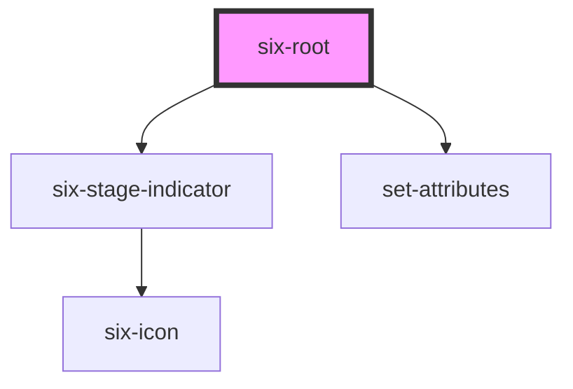

# six-root
Six root gives you a [basic layout](https://en.wikipedia.org/wiki/Holy_grail_(web_design)) skeleton.

<!-- EXAMPLES -->

<!-- Auto Generated Below -->

## Properties

| Property     | Attribute    | Description                                                                    | Type                                                | Default |
| ------------ | ------------ | ------------------------------------------------------------------------------ | --------------------------------------------------- | ------- |
| `breakpoint` | `breakpoint` | Breakpoint for smaller screens when the right sidebar is collapsed by default. | `number`                                            | `1024`  |
| `padded`     | `padded`     | Defines whether the content section should be padded                           | `boolean`                                           | `true`  |
| `stage`      | `stage`      | Defines the stage of the application                                           | `"ACCEPTANCE" \| "DEV" \| "ETU" \| "ITU" \| "PROD"` | `null`  |
| `version`    | `version`    | Defines the version of the application                                         | `string`                                            | `''`    |

## Events

| Event                | Description                           | Type                                   |
| -------------------- | ------------------------------------- | -------------------------------------- |
| `six-root-collapsed` | Emitted when display size is updated. | `CustomEvent<SixRootCollapsedPayload>` |

## Slots

| Slot              | Description                                     |
| ----------------- | ----------------------------------------------- |
| `"footer"`        | Used to define the footer component.            |
| `"header"`        | Used to define the header component.            |
| `"left-sidebar"`  | Used to define the side bar on the left side.   |
| `"main"`          | Used to define the components in the main area. |
| `"right-sidebar"` | Used to define the side bar on the right side.  |

## Shadow Parts

| Part              | Description |
| ----------------- | ----------- |
| `"container"`     |             |
| `"header"`        |             |
| `"left-sidebar"`  |             |
| `"main"`          |             |
| `"right-sidebar"` |             |

## Dependencies

### Depends on

- [six-stage-indicator](../six-stage-indicator)
- [set-attributes](../../wrappers/set-attributes)

### Graph

----------------------------------------------

Copyright © 2021-present SIX-Group
