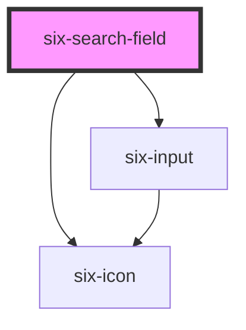

# six-search-field

<!-- EXAMPLES -->

<!-- Auto Generated Below -->

## Properties

| Property      | Attribute     | Description                                                    | Type      | Default                 |
| ------------- | ------------- | -------------------------------------------------------------- | --------- | ----------------------- |
| `clearable`   | `clearable`   | Set to true to add a clear button when the input is populated. | `boolean` | `false`                 |
| `debounce`    | `debounce`    | Debounce time in milliseconds, default is 300 ms               | `number`  | `DEFAULT_DEBOUNCE_FAST` |
| `disabled`    | `disabled`    | Set to true to disable the input.                              | `boolean` | `false`                 |
| `placeholder` | `placeholder` | The input's placeholder text.                                  | `string`  | `undefined`             |
| `value`       | `value`       | The input's value attribute.                                   | `string`  | `''`                    |

## Events

| Event                     | Description                        | Type                                       |
| ------------------------- | ---------------------------------- | ------------------------------------------ |
| `six-search-field-change` | Emitted when a search is triggered | `CustomEvent<SixSearchFieldChangePayload>` |

## Slots

| Slot | Description                                            |
| ---- | ------------------------------------------------------ |
|      | Used to define the results below the search component. |

## Dependencies

### Depends on

- [six-input](../six-input)
- [six-icon](../six-icon)

### Graph

----------------------------------------------

Copyright © 2021-present SIX-Group
