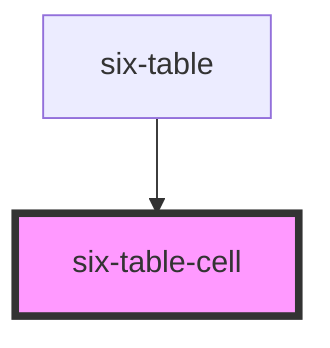

# six-table-cell

<!-- EXAMPLES -->

<!-- Auto Generated Below -->

## Slots

| Slot | Description                             |
| ---- | --------------------------------------- |
|      | Used to define the content of the cell. |

## Dependencies

### Used by

 - [six-table](../six-table)

### Graph

----------------------------------------------

Copyright © 2021-present SIX-Group
