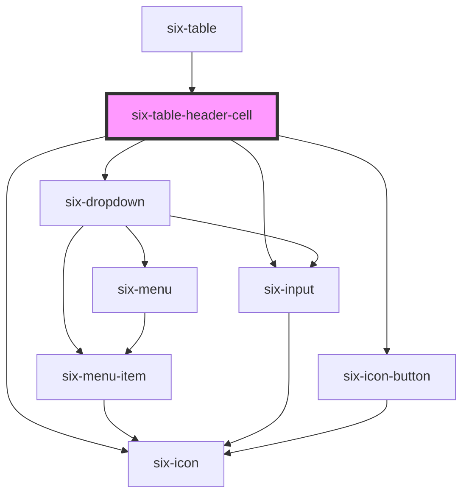

# six-table-header-cell

<!-- EXAMPLES -->

<!-- Auto Generated Below -->

## Properties

| Property | Attribute | Description                                                             | Type                           | Default     |
| -------- | --------- | ----------------------------------------------------------------------- | ------------------------------ | ----------- |
| `filter` | `filter`  | Filter mode. Applied only when set.                                     | `"eq" \| "in" \| "ne" \| "ni"` | `undefined` |
| `name`   | `name`    | Table row property name. Used in the custom events to identify the row. | `string`                       | `undefined` |
| `sort`   | `sort`    | Sort direction. Applied only when set.                                  | `"asc" \| "desc" \| "none"`    | `undefined` |
| `value`  | `value`   | Filter value. Applied only when filter mode is set.                     | `string`                       | `undefined` |

## Events

| Event                                  | Description                           | Type                                                             |
| -------------------------------------- | ------------------------------------- | ---------------------------------------------------------------- |
| `six-table-header-cell-filter-updated` | Emitted when filter model is updated. | `CustomEvent<{ [x: string]: BasedOnKeys<FilterMode, string>; }>` |
| `six-table-header-cell-sort-updated`   | Emitted when sort model is updated.   | `CustomEvent<{ [x: string]: SortDirection; }>`                   |

## Slots

| Slot | Description                                   |
| ---- | --------------------------------------------- |
|      | Used to define the label of the header field. |

## Dependencies

### Used by

 - [six-table](../six-table)

### Depends on

- [six-icon](../six-icon)
- [six-dropdown](../six-dropdown)
- [six-input](../six-input)
- [six-icon-button](../six-icon-button)

### Graph

----------------------------------------------

Copyright © 2021-present SIX-Group
