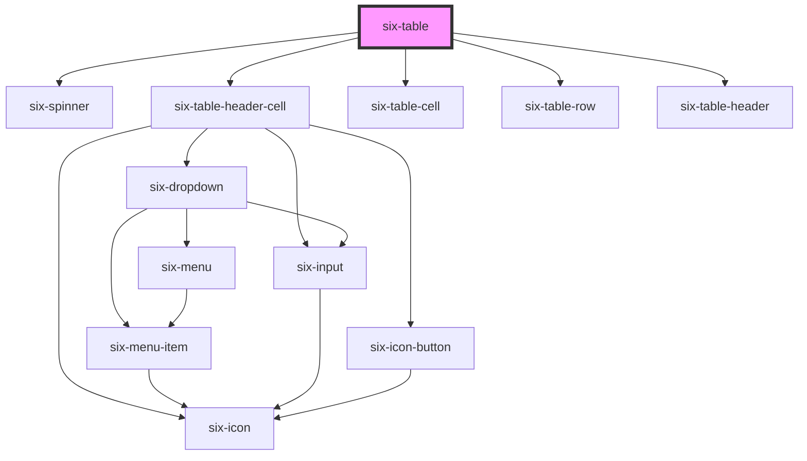

# six-table

<!-- EXAMPLES -->

<!-- Auto Generated Below -->

## Properties

| Property  | Attribute | Description                               | Type      | Default |
| --------- | --------- | ----------------------------------------- | --------- | ------- |
| `loading` | `loading` | Set to true to display loading indicator. | `boolean` | `false` |
| `striped` | `striped` | Set to true to stripe the table.          | `boolean` | `false` |

## Events

| Event                    | Description                         | Type                                         |
| ------------------------ | ----------------------------------- | -------------------------------------------- |
| `six-table-cell-clicked` | Emitted when table cell is clicked. | `CustomEvent<TableCellClickedPayload<Item>>` |
| `six-table-ready`        | Emitted when table is ready.        | `CustomEvent<TableReadyPayload>`             |
| `six-table-row-clicked`  | Emitted when table row is clicked.  | `CustomEvent<TableRowClickedPayload<Item>>`  |

## Methods

### `setData<T extends Item>(value: Data<T>) => Promise<void>`

#### Returns

Type: `Promise<void>`

## Slots

| Slot | Description                                      |
| ---- | ------------------------------------------------ |
|      | Used to define header and the rows of the table. |

## Dependencies

### Depends on

- [six-spinner](../six-spinner)
- [six-table-header-cell](../six-table-header-cell)
- [six-table-cell](../six-table-cell)
- [six-table-row](../six-table-row)
- [six-table-header](../six-table-header)

### Graph

----------------------------------------------

Copyright © 2021-present SIX-Group
